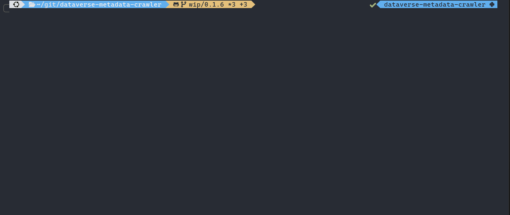

[](https://www.repostatus.org/#active)
[](https://opensource.org/license/mit)
[](https://dataverse.org/)
[](https://github.com/psf/black)
[](https://mybinder.org/v2/gh/scholarsportal/dataverse-metadata-crawler/main?urlpath=%2Fdoc%2Ftree%2Fcloud_cli.ipynb)

# Dataverse Metadata Crawler


## 📜Description
A Python CLI tool for extracting and exporting metadata from [Dataverse](https://dataverse.org/) repositories. It supports bulk extraction of dataverses, datasets, and data file metadata from any chosen level of dataverse collection (an entire Dataverse repository/sub-Dataverse), with flexible export options to JSON and CSV formats.

## ✨Features
1. Bulk metadata extraction from Dataverse repositories at any chosen level of collection (top level or selected collection)
2. JSON & CSV file export options

## ☁️ Installation (Cloud - Slower)
Click 
[](https://mybinder.org/v2/gh/scholarsportal/dataverse-metadata-crawler/main?urlpath=%2Fdoc%2Ftree%2Fcloud_cli.ipynb)
to launch the crawler directly in your web browser—no Git or Python installation required!

## ⚙️Installation (Locally - Better performance)

### 📦Prerequisites
1. [Git](https://git-scm.com/)
2. [Python 3.11+](https://www.python.org/)
---
1. Clone the repository
   ```sh
   git clone https://github.com/scholarsportal/dataverse-metadata-crawler.git
   ```

2. Change to the project directory
   ```sh
   cd ./dataverse-metadata-crawler
   ```

3. Create an environment file (`.env`)
   ```sh
   touch .env  # For Unix/MacOS
   nano .env   # or vim .env, or your preferred editor
   # OR
   New-Item .env -Type File   # For Windows (Powershell)
   notepad .env
   ```

4. Configure the environment (`.env`) file using the text editor of your choice.
   ```sh
   # .env file
   BASE_URL = "TARGET_REPO_URL"  # Base URL of the repository; e.g., "https://demo.borealisdata.ca/"
   API_KEY = "YOUR_API_KEY"      # Found in your Dataverse account settings. Can also be specified in the CLI interface using the -a flag.
   ```
   Your `.env` file should look like this:
   ```sh
   BASE_URL = "https://demo.borealisdata.ca/"
   API_KEY = "XXXXXXXX-XXXX-XXXX-XXXX-XXXXXXXX"
   ```

5. Set up virtual environment and install the package dependencies

   1. Use `uv` for a more streamlined experience (recommended):
      ```sh
      uv sync
      ```

   2. Or the traditional way using `venv`:
      ```sh
      # For Unix/MacOS
      python3 -m venv .venv
      source .venv/bin/activate     
      pip install -e .
      ```

      ```powershell
      # For Windows (Powershell)
      python -m venv .venv
      .venv\Scripts\activate
      pip install -e .
      ```

## 🛠️Usage

### Commands

The CLI is structured as a main command with global options followed by a subcommand:

```sh
# Run the CLI using uv (recommended)
uv run dvmeta [OPTIONS] COMMAND

# Or install it as a package and run the command directly within the virtual environment
dvmeta [OPTIONS] COMMAND

# Or use it as a module with python within the virtual environment
python3 -m dvmeta.cli.app [OPTIONS] COMMAND

```

**Subcommands:**

| **Command**          | **Description**                                                     |
|----------------------|---------------------------------------------------------------------|
| `search`             | Search for datasets in the collection.                              |
| `crawl-metadata`     | Crawl and export dataset metadata to JSON.                          |
| `crawl-permission`   | Crawl and export dataset permission metadata to JSON.               |
| `export-spreadsheet` | Export crawled metadata to CSV only (No JSON).                                     |
| `run-all`            | Run all steps in sequence (search → crawl metadata → crawl permission → export spreadsheet). |

**Required options:**

| **Option**           | **Short** | **Type** | **Description**                                                                                                                                                                                                                                                                                                             | **Default**     |
|----------------------|-----------|----------|-----------------------------------------------------------------------------------------------------------------------------------------------------------------------------------------------------------------------------------------------------------------------------------------------------------------------------|-----------------|
| --collection_alias   | -c        | TEXT     | The alias of the collection to crawl. <br/> See the guide [here](https://github.com/scholarsportal/dataverse-metadata-crawler/wiki/Guide:-How-to-find-the-COLLECTION_ALIAS-of-a-Dataverse-collection) to learn how to find the collection alias. <br/> **[required]**                                                       | None            |
| --version            | -v        | TEXT     | The dataset version to crawl. Options include: <br/> • `draft` - The draft version, if any <br/> • `latest` - Either a draft (if exists) or the latest published version <br/> • `latest-published` - The latest published version <br/> • `x.y` - A specific version (e.g. `1.0`) <br/> • `x` - Same as `x.0` <br/> **[required]** | None (required) |

**Optional options:**

| **Option**              | **Short** | **Type** | **Description**                                                                                                                                                                                                 | **Default** |
|-------------------------|-----------|----------|-----------------------------------------------------------------------------------------------------------------------------------------------------------------------------------------------------------------|-------------|
| --auth                  | -a        | TEXT     | Authentication token to access the Dataverse repository. Can also be set via the `API_KEY` environment variable.                                                                                                | None        |
| --report / --no-report  | -r        |          | Output summary report file of the crawl.                                                                                                                                                                        | `--report`  |                                                                                                                                      | False       |
| --spreadsheet           | -s        |          | Output a CSV file of the metadata of datasets.<br>See the [spreadsheet column explanation notes](https://github.com/scholarsportal/dataverse-metadata-crawler/wiki/Explanation-of--Spreadsheet-Column-Headers). | False       |
| --metadata-source       | -m        | TEXT     | Filter results by metadata source. Useful for filtering harvested datasets.                                                                                                                                     | None        |
| --publication-status    | -ps       | TEXT     | Filter datasets by publication status (e.g. `Published`, `Draft`, `Unpublished`, `Deaccessioned`). Available values depend on the Dataverse installation.                                                       | None        |
| --semaphore-limit       | -sl       | INT      | Maximum number of concurrent tasks when crawling datasets. Adjust based on expected load on the Dataverse repository.                                                                                           | 5           |
| --log-level             |           | TEXT     | Logging level for console and file output. Options: `DEBUG`, `INFO`, `WARNING`, `ERROR`, `CRITICAL`.                                                                                                            | `INFO`      |
| --debug-log             | -debug    |          | Enable debug logging to a file in the `logs` directory.                                                                                                                                                         | False       |
| --help                  |           |          | Show the help message.                                                                                                                                                                                          |             |

### Examples
```sh
# Run all steps: crawl metadata and permissions for the latest version of collection 'demo'
dvmeta -c demo -v latest run-all

# Run all steps with spreadsheet output and an API token
dvmeta -c demo -v latest -p -s -a xxxxxxxx-xxxx-xxxx-xxxx-xxxxxxxx run-all

# Crawl metadata only for version 1.0 of collection 'demo'
dvmeta -c demo -v 1.0 crawl-metadata

# Filter by publication status and metadata source
dvmeta -c demo -v latest -ps Published -m Borealis run-all

# Run with increased concurrency and debug logging
dvmeta -c demo -v latest --semaphore-limit 10 --debug-log run-all
```

## 📂Output Structure

| File                                          | Description                                                                                                    |
|-----------------------------------------------|----------------------------------------------------------------------------------------------------------------|
| `ds_metadata_yyyymmdd-HHMMSS.json`            | Datasets representation & data files metadata in JSON format. Always exported.                                 |
| `permission_dict_yyyymmdd-HHMMSS.json`        | Permission metadata for all datasets. Exported when API authentication succeeds (`--auth` / `API_KEY`).        |
| `ds_metadata_yyyymmdd-HHMMSS.csv`             | Datasets and their data files' metadata in CSV format. Always exported with `run-all`.                         |
| `report_yyyymmdd-HHMMSS.txt`                     | Summary of the crawling work. Exported by default; disabled with `--no-report`.                                   |
| `debug.log`                                   | Debug log output. Exported with `--debug-log` / `-debug`.                                                      |

```sh
exported_files/
├── json_files/
│   ├── ds_metadata_yyyymmdd-HHMMSS.json        
│   └── permission_dict_yyyymmdd-HHMMSS.json    
├── csv_files/
│   └── ds_metadata_yyyymmdd-HHMMSS.csv         
└── logs_files/
    ├── report_yyyymmdd-HHMMSS.txt                 # Exported by default; use --no-report to disable
    └── debug.log                               # Only with --debug-log / -debug
```

## ⚠️Disclaimer
> [!WARNING]
> To retrieve data about unpublished datasets or information that is not available publicly (e.g. collaborators/permissions), you will need to have necessary access rights. **Please note that any publication or use of non-publicly available data may require review by a Research Ethics Board**.

## ✅Tests
No tests have been written yet. Contributions welcome!

## 💻Development
1. Dependencies management: [uv](https://docs.astral.sh/uv/) - Use `uv` to manage dependencies and reflect changes in the `pyproject.toml` file.
2. Linter: [ruff](https://docs.astral.sh/ruff/) - Follow the linting rules outlined in the `pyproject.toml` file.

## 🙌Contributing
1. Fork the repository
2. Create a feature branch
3. Submit a pull request

## 📄License
[MIT](https://choosealicense.com/licenses/mit/)

## 🆘Support
- Create an issue in the GitHub repository

## 📚Citation
If you use this software in your work, please cite it using the following metadata.

APA:
```
Lui, L. H. (2026). Dataverse Metadata Crawler (Version 0.1.7) [Computer software]. https://github.com/scholarsportal/dataverse-metadata-crawler
```

BibTeX:
```
@software{Lui_Dataverse_Metadata_Crawler_2026,
  author = {Lui, Lok Hei},
  month = {June},
  title = {Dataverse Metadata Crawler},
  url = {https://github.com/scholarsportal/dataverse-metadata-crawler},
  version = {0.1.7},
  year = {2025}
}
```

## ✍️Authors
Ken Lui - Data Curation Specialist, Map and Data Library, University of Toronto - [kenlh.lui@utoronto.ca](mailto:kenlh.lui@utoronto.ca)
